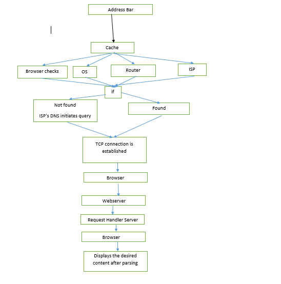

### What happens when a URL is entered on a browser ?
1.	 We type the desirable URL into the address bar.
2.	Browser checks the cache for a DNS record to find the corresponding IP address.
3.	To find the DNS record , the browser checks 4 caches:
  - Browser cache 
  - OS cache
  - Router cache 
  - ISP cache
4.	If the requested URL is not found , IPS ‘s DNS Server initiates a DNS query to find the IP adderss.
5.	Now the browser initiates a TCP connection with the server.
(Three way handshake TCP/IP) 
- Client -----SYN-----Server
- Server-----ACK------Client
- Client -----ACK------Server
6.	Now the browser sends an HTTP request to the Webserver.
7.	The Webserver passes the request to request handler to read and generate a response.
8.	The server now sends out an HTTP response.
9.	The browser displays the HTML content.

The browser retrieves the desired information from www (World Wide Web) and make it available for the user.

### Components of the browser :-
1.	The UI
It includes every part of the browser except the window.
2.	Browser engine
Controls the action between UI(User Interface) and RE(Rendering Engine).
3.	Rendering Engine
Responsible for for displaying different types of docs and images using plug-in extensions. It starts parsing the document and convert elements in to DOM nodes to contain it in the content tree. The whole document information is used to create render tree. The render tree contains visual attributes like color and dimensions. Now render tree goes through the layout process, in this process each node is assigned the exact co-ordinates where it has to be displayed. Last part is painting, the rendered tree is traversed and each node will be painted accordingly on the screen using UI backend.
4.	Networking
It calls for a HTTPs request.
5.	UI backend
Used for drawing basic widgets like combo boxes and windows.
6.	Java script interpreter
It is used to parse and execute the javascript code.
7.	Data Storage
It saves all sorts of data locally.
